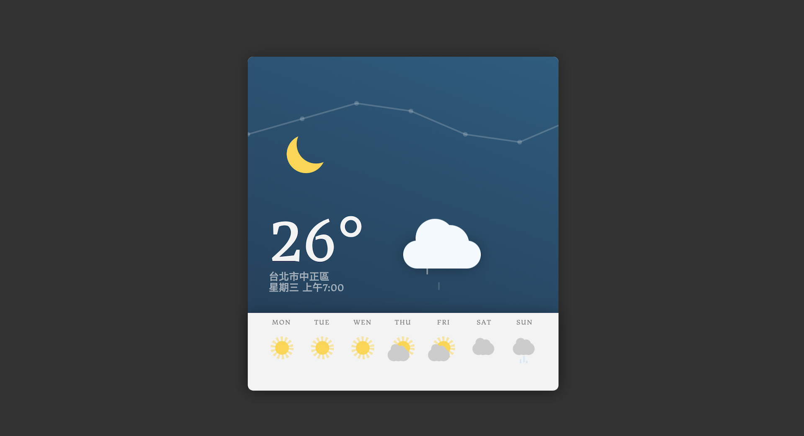

<!-- Title & Logo -->
<h1 align="center">DayBox</h1>

<!-- tag & links (Version\Lang\Package) -->
<p align="center">
    
    
    
    
</p>
<p align="center">
    Source：<a href="https://github.com/evilz0212/ex-js-memoryblock/">Github</a>
	Demo：<a href="https://evilz0212.github.io/ex-js-memoryblock/">Git Pages</a>
<p>

<!-- Overview (Preview\Purpose\Description) -->


## Overview
#### Target
1. 練習 Webapck 建置專案，客製化打包配置
2. 練習 CSS animation 基礎動畫效果

#### Detail
-   Pug：預處理模板語言
-   Sass：預處理樣式語言
-   Webpack：自訂 config 設定
    -  輸出輸入 (path, hash, env)
    -  loader (babel, sass, postcss, autoprefixer, mini-css, pug, file, image)
    -  壓縮 (purify-css, optimize-css)
    -  即時刷新 (dev-server, livereload)
    -  插件 (ProvidePlugin, jquery, GoogleFontsPlugin)

<!-- Get started (Install\Step) -->
## Get started
#### Installation
install npm packages
```
npm install
```
run dev-server
```
npm run dev
```
#### Notice
error: ```Cannot find module 'node-sass'```
```
npm i -D sass-loader node-sass
```

<!-- Partner -->

<!-- License -->